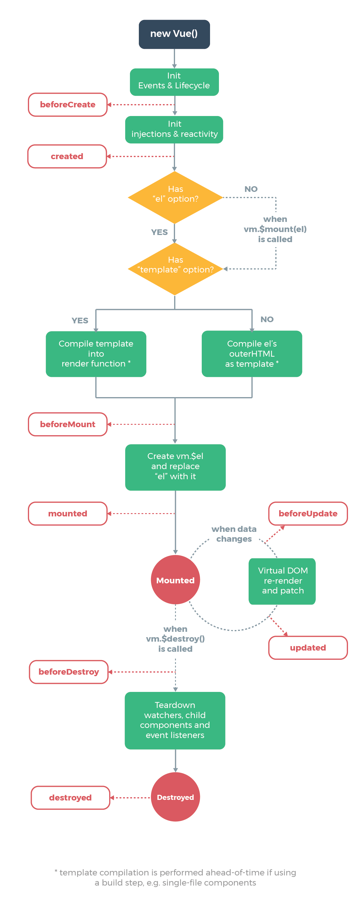

# 谈谈你对vue生命周期的理解？

## 理解

- Vue的生命周期是指Vue实例从被创建到被销毁时要经过的一系列的过程。
- 在这个过程中Vue会运行一些叫做生命周期钩子的函数，这给了用户在不同阶段添加自己的代码的机会。

## 总结

- beforeCreate：创建前，无法获取响应数据
- created：创建后
- beforeMount：挂载前
- mounted：挂载后
- beforeUpdate：数据更新前
- updated：数据更新后
- beforeDestroy：销毁前
- destroyed：销毁后

## 图示

